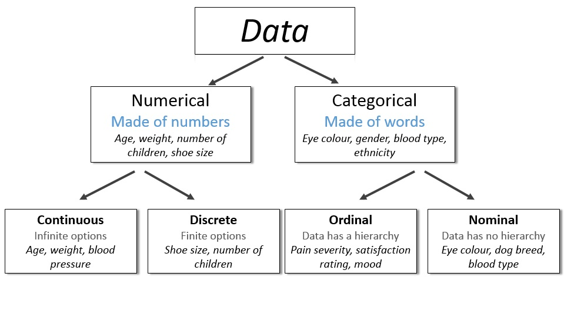
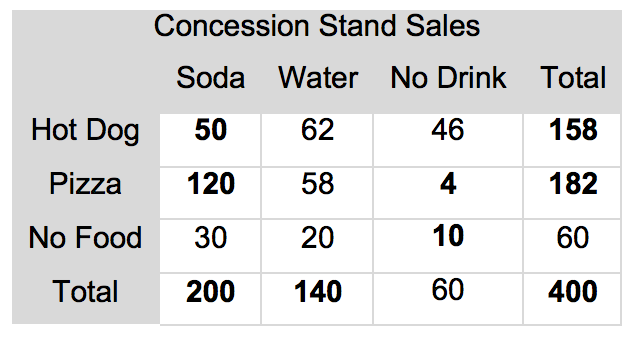
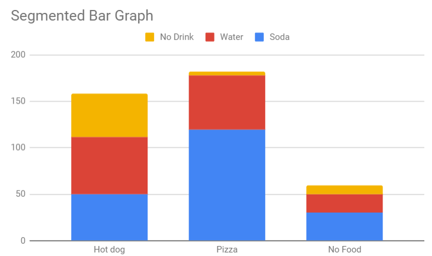

# Topcis
1. Exploring Data
    * Data sets contain information about **individuals** (such as people, animals, or things)
    * Each individual contains **variables** that describe them (height, gender, eye color)
    * Variables are **categorical** if it has a label (gender, hair color, age range)
    * Variables are **quantitative** if it has a numerical value (weight, age, height)
    * 
2. Analyzing Categorical Data
    * A distribution of a categorical variable can tell you the **frequency** (100/500 people have brown hair) or the **relative frequency** (20% of people have brown hair)
    * **Pie charts** and **bar graphs** can display the distribution of a categorical variable.
    * A **two way table** organizes data about two categorical variables for the same individuals.
        * The **marginal distribution** is one of the categorical variables over the total number of individuals. It looks at a single variable
            * $\Large\frac{200\text{ Soda}}{400\text{ Total}}$, $\Large\frac{158\text{ Hot Dog}}{400\text{ Total}}$
        * The **conditional distribution** compares the value of one variable to the value of another
            * $\Large\frac{62\text{ Water & Hot Dog}}{140\text{ Total Water}}$
        * 
    * A **segmented bar graph** or a **side by side bar graph** can be used to display conditional distributions
        * 
3. Displaying Quantitative Data with Graphs
    * **dotplots**, **stemplots**, and **histograms** show the distribution of a quantitative variable
    * **Shape**, **center**, and **spread** describes the overall pattern.
        * **Outliers** shows departures from the pattern.
    * Some distributions are **symmetric**, **left-skewed**, or **right-skewed**
4. Describing Quantitative Data with Numbers
    * The **mean** and **median** describe the center of a distribution.
    * The **standard deviation** and **IQR** are measures of spread
    * The mean and standard deviation should only be used with roughly symmetric distributions 
# Formulas

$$
\LARGE
\bar{x}=\frac{\sum x_i}{n}
\\[20pt]
\LARGE
S_x=\sqrt{\frac{\sum (x_i-\bar{x})^2}{n-1}}
\\[35pt]
\LARGE
IQR = Q_3 - Q_1
\\[20pt]
\LARGE
\text{outlier} = Q_{-1/+3} \pm (1.5*IQR)
$$

# Terms
<iframe src="https://quizlet.com/310824648/flashcards/embed" height="700" width="100%" style="border:0"></iframe>